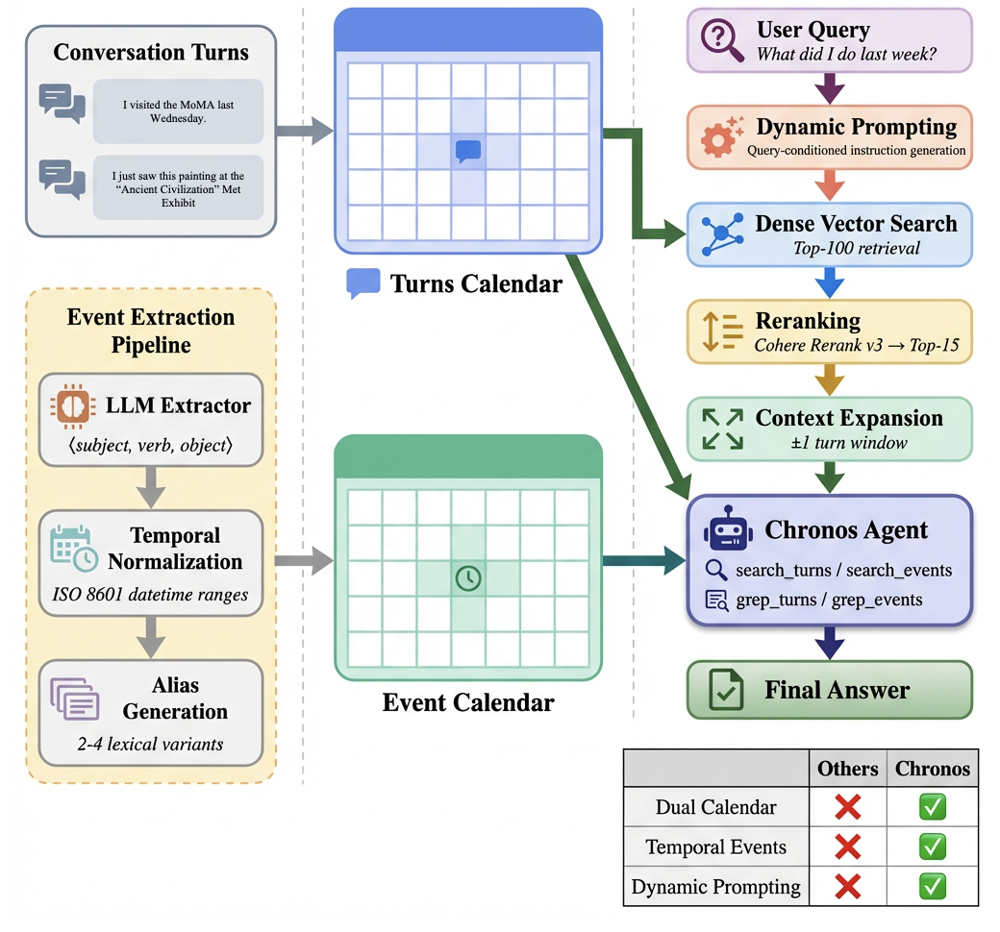
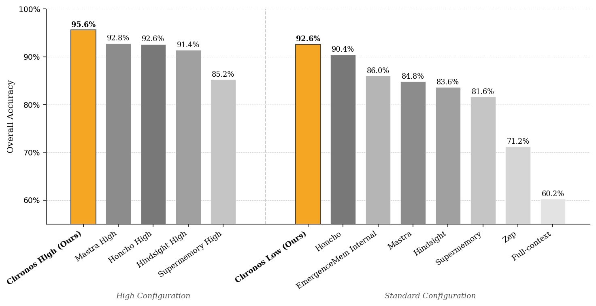
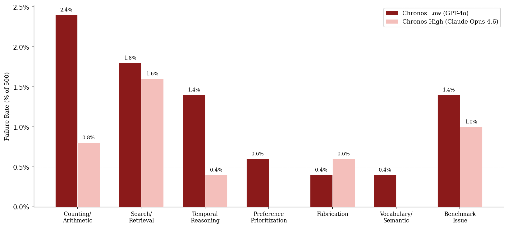

# 多篇论文综述资料

---

## 文献 1：2603.16862v1
- 来源文件：2603.16862v1.pdf
- 文档编号：doc_001
- 排序序号：1

# 2603.16862v1


## Chronos: Temporal-Aware Conversational Agents with

## Structured Event Retrieval for Long-Term Memory

 Elias Lumer   Sahil Sen  Commercial Technology and Innovation Office, Commercial Technology and Innovation Office, PricewaterhouseCoopers PricewaterhouseCoopers U.S.

U.S.

elias.lumer@pwc.com sahil.s.sen@pwc.com  Anmol Gulati   Vamse Kumar Subbiah  Commercial Technology and Innovation Office, Commercial Technology and Innovation Office,

# arXiv:2603.16862v1  [cs.CL]  17 Mar 2026

PricewaterhouseCoopers PricewaterhouseCoopers U.S.

U.S.

### Abstract

Recent advances in Large Language Models (LLMs) have enabled conver- sational AI agents to engage in extended multi-turn interactions spanning weeks or months. However, existing memory systems struggle to reason over temporally grounded facts and preferences that evolve across months of interaction and lack effective retrieval strategies for multi-hop, time- sensitive queries over long dialogue histories. We introduce Chronos, a novel temporal-aware memory framework that decomposes raw dialogue into subject-verb-object event tuples with resolved datetime ranges and entity aliases, indexing them in a structured event calendar alongside a turn calendar that preserves full conversational context. At query time, Chronos applies dynamic prompting to generate tailored retrieval guidance for each question, directing the agent on what to retrieve, how to filter across time ranges, and how to approach multi-hop reasoning through an iterative tool-calling loop over both calendars. We evaluate Chronos with 8 LLMs, both open-source and closed-source, on the LongMemEvalS benchmark comprising 500 questions spanning six categories of dialogue history tasks.

Chronos Low achieves 92.60% and Chronos High scores 95.60% accuracy, setting a new state of the art with an improvement of 7.67% over the best prior system. Ablation results reveal the events calendar accounts for a

58. 9% gain on the baseline while all other components yield improvements

between 15.5% and 22.3%. Notably, Chronos Low alone surpasses prior approaches evaluated under their strongest model configurations.

### 1 Introduction

The rapid progress of Large Language Models (LLMs) has enabled conversational AI agents to maintain contextual awareness across extended multi-turn interactions, supporting per- sonalized assistance over weeks or months of conversation historyTan(2025). With break- throughs in RAG for conversational memory, LLM agents can efficiently access historical information without exhausting context window limits (Wu et al.(2025c)). As these systems are deployed in domains requiring persistent user engagement, the ability to accurately recall, track, and reason over temporally grounded events across sessions becomes essential.

Despite these advancements, conversational memory systems have struggled to find the right balance between structured knowledge building and retrieval simplicity. Systems employing comprehensive knowledge graphs extract all facts and relationships at inges- tion time, building elaborate graph structures with entity resolution, fact validation, and temporal metadata (Rasmussen et al.(2025)). However, this global extraction creates large 1

<!-- Page 2 -->



Figure 1: An overview of the Chronos Architecture. Event Extraction, Dual Indexing, and Query Processing result in a generated answer.

knowledge bases even when queries require only a subset of information. Simpler turn- level retrieval approaches avoid this overhead through direct dense-sparse hybrid search over conversation turns, but lack the structured temporal representations needed for time- sensitive queries involving date calculations or cross-session event aggregation (Haley et al.

(2025)). Recent systems have introduced background reasoning pipelines that generate derived facts, timelines, and behavioral patterns through offline ”dreaming” or observa- tional analysis, but these query-independent deductions introduce context entropy when the precomputed knowledge proves irrelevant to specific questions (McCormick & Leer (2025)). While these systems employ LLM-based temporal normalization, they rely on global extraction strategies that process all conversational content uniformly, and they only normalize time within fact strings. The core challenge remains: comprehensive memory building introduces overhead and context entropy through over-structuring, while pure turn-level retrieval lacks temporal grounding for time-sensitive reasoning. No existing approach achieves query-conditioned selective extraction, structuring only the temporal in- formation relevant to answering specific questions while preserving conversational context for semantic understanding.

In this paper, we introduce Chronos (visualized in Figure1), a conversational memory frame- work centered on query-conditioned selective extraction. Chronos outperforms both pure turn-level retrieval and comprehensive knowledge-base construction. Rather than extract- ing all facts and relationships during ingestion or generating derived knowledge through background reasoning pipelines, Chronos performs targeted event extraction focused on temporally-grounded state transitions and timestamped occurrences, indexed alongside raw conversation turns. This approach extracts only what is necessary while avoiding the context entropy introduced by comprehensive fact extraction or query-independent background deductions. To our knowledge, Chronos is the first architecture that combines the simplicity of turn-level retrieval with selective temporal event extraction: conversation 2

<!-- Page 3 -->

turns provide full conversational context for semantic understanding, while extracted events with structured datetime ranges enable precise temporal filtering and cross-session aggre- gation. In addition, Chronos implements dynamic prompting, extending query rewriting from the RAG literature to long-term memory. Rather than reformulating the search query, Chronos analyzes each question and generates tailored retrieval guidance for the agent.

By structuring exactly what LLMs struggle with (temporal deltas, event sequences, date calculations) and leaving the rest as natural language turns, Chronos achieves the minimal sufficient abstraction for conversational memory.

We evaluate Chronos on the LongMemEvalS benchmarkWu et al.(2025a) comprising 500 questions across six categories. Chronos Low achieves 92.60% accuracy, establishing state-of- the-art performance (+7.67% relative to EmergenceMem Internal). Chronos High achieves

95. 60% accuracy, the highest reported performance on this benchmark (+3.02% relative to

Mastra’s OM).

### 2 Related Work

We organize existing work in conversational memory along four themes—the distinction between short-term and long-term memory, knowledge accumulation strategies, retrieval architectures, and summarization and fact extraction—highlighting how each reveals a gap in temporal structuring that Chronos addresses.

2. 1

 Long-Term Conversational Memory  Modern LLM context windows largely address short-term, or within-session, memory, allowing models to attend to prior turns without explicit memory mechanismsTan(2025).

Long-term, or across-session, memory presents a harder challenge: retaining and retrieving information from conversations that occurred days or months earlier and no longer reside in context. The model has to keep track of relationships over long periods of time, be able to connect and aggregate discrete events in the user’s history, and understand changes to user preferences. There are two primary benchmarks that evaluate a model’s long-term memory capabilities. LongMemEvalSevaluates 500 questions across six categories, including knowledge-update tracking, multi-session aggregation, and temporal reasoning (Wu et al.

(2025a)). LoCoMo evaluates memory over naturalistic human conversations spanning up to 35 sessions, measuring single-hop, multi-hop, temporal, and adversarial question answering (Maharana et al.(2024)). However, prior work has noted several limitations: most sessions fit within modern context windows, the dataset does not evaluate knowledge updates (a key part of long-term memory), and a variety of technical errors in the benchmark itself (Chalef & Rasmussen (2025)). Notably, neither benchmark isolates the role of temporal structuring in long-term memory, leaving open the question of how much explicit temporal representation is needed for accurate cross-session reasoning.

2. 2

 Knowledge Accumulation and Representations  Conversational memory systems must decide how to represent the knowledge they ex- tract from dialogue. Broadly, representations fall along a spectrum from structured to unstructured. At the structured end, knowledge graphs encode entities and relationships as typed edges, enabling explicit reasoning over connections. Graph-based systems allow information to be retrieved logically and quickly. Simpler knowledge-graph architectures rely on a two-stage approach, first generating the structure and then filling in the details (Edge et al.(2025)). More complex systems integrate three or more different types of nodes (Rasmussen et al.(2025)). On the unstructured end, many systems preserve raw conversa- tional text or generate natural language summaries and observations. Some approaches deploy specialized agents that monitor conversations and produce timestamped annotations (Barnes(2026)). Others organize memory into hierarchical tiers that progressively consol- idate episodic details into semantic summaries (Packer et al.(2024)). Hybrid approaches maintain both raw dialogue and extracted atomic facts as parallel corpora, preserving origi- nal context alongside structured knowledgeMcCormick & Leer(2025);Haley et al.(2025).

3

<!-- Page 4 -->

A key tension across all these representations is that knowledge accumulation typically proceeds at ingestion time, independent of any future query. Systems must anticipate which facts, relationships, or observations will prove relevant, an inherently lossy process. When precomputed representations do not align with query-time information needs, irrelevant context dilutes the retrieval signal. No existing representation scheme targets only tem- porally grounded events for structured indexing while retaining raw dialogue for general semantic queries, forcing systems to choose between comprehensive extraction and retrieval simplicity.

2. 3

 Retrieval-Augmented Architectures  To address context entropy, many system architectures implement some form of retrieval to locate relevant information at query time. Sparse retrieval methods like BM25 excel at exact lexical matching and are computationally efficient, but miss semantic variations and synonymy (Robertson & Zaragoza(2009)). Dense retrieval using learned embeddings captures semantic similarity but struggles with precise term matching and rare entities (Karpukhin et al.(2020)) and introduces computational overhead in generating and storing embeddings. Hybrid approaches that fuse both modalities (typically via reciprocal rank fusion or learned reranking) have emerged as the dominant paradigm in RAG systems, consistently outperforming either method alone (Sawarkar et al.(2024),Yang et al.(2025)).

More sophisticated conversational memory systems combine three or more retrieval modali- ties in parallel, such as cosine similarity, BM25, and graph traversal (Rasmussen et al.(2025)) or pair dense-sparse hybrid search with fine-tuned cross-encoders for reranking (Haley et al.(2025)). Simpler systems rely on vector-only cosine similarity with configurable top-k retrieval (Barnes(2026)).

Within the retrieval pipeline, pre-retrieval query processing has proven effective for improv- ing recall in document RAG. Query rewriting reformulates user queries to fix ambiguities, resolve pronouns, and better align with indexed content Ma et al. (2023). Hypothetical document embeddings (HyDE) generate synthetic answers to bridge the query-document se- mantic gapGao et al.(2022). Query decomposition breaks complex multi-hop questions into sequential sub-queries, each retrievable independentlyGao et al.(2024). These techniques are well-established in document retrieval, and recent work has applied query rewriting and decomposition to tool selectionLumer & Sen(2025). However, no conversational memory system applies query-aware retrieval guidance to long-term memory, where questions span categories (temporal reasoning, knowledge updates, preference recall) that each demand fundamentally different retrieval strategies.

Beyond static retrieval pipelines, agentic RAG introduces a tool-calling paradigm in which an LLM autonomously decides when and how to retrieve additional context, iteratively refining its search until sufficient evidence is gathered (Asai et al.(2023)). This approach transforms retrieval from a single-shot operation into a multi-step reasoning process, as the agent can decompose complex queries, issue multiple targeted searches, and synthesize results across retrieval rounds. Some conversational memory systems deploy tool-calling research agents that dynamically expand context during inference when initial retrieval proves insufficient (McCormick & Leer (2025)). Others introduce autonomous retrieval controllers with evidence-gap trackers that route between different retrieval actions based on accumulated evidence (Du et al. (2025)). Although agentic retrieval improves recall on complex, multi-hop queries, it introduces latency and cost at inference time, creating a tradeoff between retrieval thoroughness and system responsiveness. Existing retrieval architectures also lack query-conditioned adaptation of the retrieval strategy itself, applying the same pipeline regardless of whether a query demands temporal filtering, semantic matching, or cross-session aggregation.

2. 4

 Summarization and Fact Extraction  Converting raw conversation history into compact, retrievable representations can require either summarization or structured fact extraction. Summarization approaches condense di- alogue into natural language summaries at varying granularities: recursive summarization 4

<!-- Page 5 -->

progressively compresses conversation history across sessions while event-based methods like elementary discourse unit (EDU) extraction rewrite sessions into self-contained, event- like statements that normalize entities and resolve coreferences (Wang et al.(2025)). Fact extraction takes a more structured approach, decomposing conversations into atomic knowl- edge units such as entity-relation triples, timestamped observations, or tagged assertions.

Some architectures generate timestamped natural language observations via monitoring agents (Barnes(2026)). Others derive latent assertions with confidence scores through offline reasoning processes (McCormick & Leer(2025)). A further distinction is*when*extraction occurs: most systems extract at ingestion time independent of any query, while query- conditioned variants additionally extract facts from retrieved turns in response to a specific question, improving relevance at the cost of additional inference-time computation (Haley et al.(2025)). However, no existing system selectively structures only temporal events while preserving raw dialogue for semantic retrieval, leaving a gap in architectures that balance extraction specificity with conversational context preservation.

### 3 The Chronos Architecture

Conversational memory systems must balance the overhead of structured knowledge building against the temporal blindness of pure turn-level retrieval. Chronos addresses this by selectively structuring only temporally grounded events while preserving raw dialogue for semantic retrieval (Figure 1). The system consists of four main components: (1) the event extraction pipeline that identifies timestamped occurrences from conversation text (subsection 3.1), (2) the dynamic prompting system, extending query rewriting to long- term memory by generating per-question retrieval guidance (subsection3.2), (3) an initial retrieval stage using dense search with reranking (subsection 3.3), and (4) the Chronos Agent with tool-calling capabilities for answering memory queries (subsection3.4). Chronos maintains two complementary calendars: an event calendar containing extracted temporal events with structured datetime ranges, and a turn calendar preserving raw conversational exchanges, enabling accurate recall for queries requiring time-grounded reasoning.

3. 1

 Event Extraction  The event extraction pipeline identifies temporally-grounded occurrences from conversation text using LLM-powered extraction. Given a conversation turn with timestamp*t*conv, the ex- tractor identifies events if they have all of the following:*⟨*subject, verb, object*⟩*. The pipeline implements multi-resolution temporal normalization to convert natural language time references into precise ISO 8601 datetime ranges. Each event receives both start datetime and end datetimefields that capture the full temporal span of when the event could have occurred. For ambiguous expressions like ”recently” or ”last month,” the system computes appropriate temporal windows centered on or relative to*t*conv with appropriate granularity for the expression. This representation enables precise temporal filtering during retrieval by encoding all possible times the event could have occurred rather than single point estimates.

Beyond structured extraction, the system generates 2-4 lexical aliases for each event using completely different vocabulary to improve text search recall. These aliases paraphrase the event using synonyms, related terms, or category descriptors that avoid repeating key nouns from the original text. For example, ”bought Fitbit” generates aliases like ”picked up a fitness tracker,” ”got a step counter,” and ”purchased a wearable.” This alias generation enables robust keyword matching when users query their memory using alternative phrasings.

To extract events, within each session, turns are passed to the extractor in batches of maxi- mum 25 turns, with 5-turn overlap between chunks. However, most sessions contain fewer than 25 turns, thus fitting into a single batch. This event-only representation intentionally avoids global entity graphs or comprehensive fact extraction, structuring only what is necessary for temporal reasoning.

Once extracted, events are embedded using the text-embedding-3-large model and uploaded to the event calendar index, while raw turns are embedded and uploaded to the turn calendar index, enabling independent retrieval over each representation.

5

<!-- Page 6 -->

3. 2

 Dynamic Prompting  Chronos introduces dynamic prompting for long-term memory, extending query rewriting from the document retrieval literatureMa et al.(2023);Gao et al.(2024) to conversational memory. Rather than reformulating the search query itself, dynamic prompting analyzes each question to generate retrieval guidance tailored to the agent’s reasoning process.

Given a user query*q*, the system generates a custom instruction preamble that directs the agent’s attention to relevant information dimensions and retrieval strategies. The template generator uses an LLM meta-prompt to analyze the question structure and produce tailored guidance. The meta-prompt instructs the generator to extract question targets (entities, attributes, temporal constraints, operations) and output 1-5 concrete bullets describing what information the agent should retrieve. For example, given ”What camera lens did I buy most recently?”, the generator outputs: ”Pay close attention to the following information (current and past): Details about camera lens purchases, specifically the most recent purchase and the lens type/model.” The generated preamble integrates into the agent’s system prompt alongside retrieval tool descriptions, chain-of-thought guidelines, and pre-retrieved context as detailed in Subsec- tion3.3. This approach enables the system to dynamically adjust retrieval breadth, temporal handling, and reasoning patterns without requiring separate models or architectures for different question types. The template generator runs once per question during inference, using a small, efficient model (Gemini 3 Flash). Static prompts cannot anticipate the diver- sity of long-term memory queries, which range from temporal filtering (”What did I do last March?”) to preference recall (”What kind of coffee do I like?”) to cross-session aggregation (”How many times did I exercise?”). By generating query-specific guidance, the system adapts its retrieval strategy without requiring separate prompt templates or classifiers for each question category.

3. 3

 Initial Retrieval  Given a user query *q*, the initial retrieval stage provides the agent with conversational context from the turn calendar before tool-based reasoning begins. Retrieval proceeds through a three-stage pipeline: vector search, reranking, and context expansion. First, dense vector search queries the turn calendar to retrieve the top 100 conversation exchanges based on cosine similarity between the query embedding  v *q* and turn embeddings  v *t*. Second, Chronos applies cross-encoder reranking to improve relevance, using Cohere Rerank v3 to rescore the 100 retrieved candidates based on semantic similarity between the query and turn text. After reranking, the top-15 most relevant turns are selected. Finally, each of the 15 selected turns is expanded with conversational context by retrieving one turn before and one turn after from the same conversation session. This context window provides surrounding dialogue that helps the agent understand references, continuity, and conversational flow.

Retrieved turns are formatted into hierarchical natural language context blocks organized by conversation date. Turns group by session with date headers like ”Session 1 (2024-02-15)” to make temporal relationships explicit. This pre-retrieved context initializes the agent with relevant background before tool-based reasoning, reducing the need for redundant searches during inference while providing comprehensive coverage of semantically relevant conversations. Finally, the agent is presented with the original question and its date.

3. 4

 Chronos Agent  The Chronos Agent is an LLM agent with native tool-calling capabilities for iterative memory retrieval. The agent receives the fully assembled dynamic prompt (detailed in Subsection3.2) and access to search tools for dynamic re-querying during inference. We equip the agent with vector search tools and grep-based text search tools for both the turn calendar and event calendar. Vector search tools (search turns, search events) enable semantic retrieval by querying each calendar’s index with agent-generated keywords or rephrased queries.

Grep tools (grep turns, grep events) enable exact keyword matching on local files. The grep capability proves particularly valuable when users reference specific entities or exact phrases that vector search may miss due to embedding similarity thresholds.

6

<!-- Page 7 -->

The agent follows a ReAct reasoning pattern, alternating between thought generation, tool calling, and observation processingYao et al.(2023). At each step, the agent decides whether to answer directly using pre-retrieved context, invoke search tools to gather additional infor- mation, or use grep tools for precise keyword matching. Tool calls execute asynchronously with automatic retry logic for robustness against transient failures. Retrieved results from tool calls are appended to the agent’s message history, progressively building up contextual information until the agent can confidently answer the query. The agent is allowed to select the top-k to retrieve, and, for dense retrieval, reranking from k=100 is applied. Notably, reranking is applied to the original question rather than the agent’s query. This design allows the agent to iteratively constrain retrieval by datetime range, cross-reference events with source dialogue, and expand the search space when evidence is insufficient, resulting in more reliable long-horizon reasoning.

3. 5

 Benchmarks  We evaluate Chronos on the LongMemEvalS Benchmark. After reasoning and tool-calling, the Chronos Agent outputs a hypothesis. From there, we implement LongMemEval’s LLM judge, which compares the hypothesis to the ground truth, routing to a specific prompt based on the question’s category. Manual inspection reveals benchmark limitations.

Question 6d550036 asks “How many projects have I led or am currently leading?” with reference answer 2, yet the history explicitly mentions more than three projects with clear leadership statements. There are also issues with the evaluation methodology. Question 75f70248 asks about sneezing in the living room with a preference rubric requiring mention of the user’s cat Luna and HEPA filters. Our system addresses the new cat as a potential source of allergies yet receives an incorrect judgment, highlighting LLM-as-judge variability.

Many of these issues have been raised in the repository for the datasetWu et al.(2025b).

### 4 Experiments

We evaluate Chronos against state-of-the-art conversational memory systems including EmergenceMem Internal, Honcho, Mastra, and Zep. To ensure fair comparison, we report results under two configurations: Chronos Low, which uses GPT-4o as the generation model to match the evaluation setup used by all compared systems, and Chronos High, which uses Claude Opus 4.6 to explore performance at a higher model capability tier. Chronos Low achieves 92.60% accuracy, establishing state-of-the-art performance among practical methods evaluated with GPT-4o, while Chronos High reaches 95.60%, demonstrating the increased reasoning capabilities of more recent models.

4. 1

 Experimental Settings   Baselines.

Chronos Low is compared against four existing practical conversational mem- ory systems evaluated on LongMemEval: EmergenceMem Internal, Honcho, Mastra, and Zep, most of which report results using GPT-4o. For Chronos High, the comparison narrows to the subset of these systems that report results under stronger LLM configurations. Full evaluation results across a diverse set of LLMs can be found in AppendixA. All runs use the text-embedding-3-large model with temperature set to 0.

 Metrics.

Accuracy serves as the primary metric, computed as the percentage of questions answered correctly across all 500 questions. Where possible, a breakdown of accuracy across each of the six categories is also provided.

 Implementation.

All models are accessed via their respective commercial APIs at standard pricing tiers. We set temperature to 0 for all generation calls to ensure deterministic outputs.

7

<!-- Page 8 -->

Table 1: Comparison of Chronos Low with state-of-the-art conversational memory systems on LongMemEval.

Category-Level Accuracy (%) Method Overall KU MS SSA SSP SSU TR  Chronos Low (Ours)

92. 60
96. 15
91. 73
100. 00
90. 23
80. 00
94. 29

Honcho†

90. 00
90. 40
94. 87
84. 96
96. 43
94. 29
88. 72
100. 00
98. 57

EmergenceMem Internal

86. 00
83. 33
81. 20
60. 00
85. 71
98. 57

Mastra

84. 80
85. 90
79. 70
82. 14
73. 33
85. 71

Supermemory

81. 60
88. 50
71. 40
96. 40
70. 00
97. 10
76. 70

Hindsight‡

83. 60
84. 60
79. 70
94. 60
66. 70
95. 70
79. 70

Zep

71. 20
83. 30
57. 90
80. 40
56. 70
92. 90
62. 40

Full-context

60. 20
78. 20
44. 30
94. 60
20. 00
81. 40
45. 10

†Honcho evaluated on Claude Haiku 4.5, not GPT-4o, so results are not directly comparable to other existing systems.

‡Hindsight evaluated with OSS-20B as the actor model and used OSS-120B as the judge model; results are not directly comparable to GPT-4o-judged systems.

Table 2: Comparison of systems with more advanced LLMs on LongMemEval.

Category-Level Accuracy (%) Method Overall KU MS SSA SSP SSU TR  Chronos High (Ours)

95. 60
100. 00
88. 72
100. 00
100. 00
98. 57
95. 50

Honcho†

92. 60

- - - - - - Mastra

92. 80
94. 90
87. 20
96. 40
90. 00
97. 10
94. 00

Supermemory

85. 20
89. 70
76. 70
98. 20
70. 00
98. 60
82. 00

Hindsight‡

91. 40
94. 90
87. 20
96. 40
80. 00
97. 10
91. 00

†Category-level accuracy not reported.

‡Evaluated with an OSS-120B judge model; results are not directly comparable to systems evaluated with the official benchmark judge.

4. 2

 Results  Table1presents the overall and category-level accuracy for Chronos compared to baseline conversational memory systems. Chronos achieves 92.60% overall accuracy, representing the highest performance among non-oracle methods on LongMemEval. Compared to Emer- genceMem Internal (86%), Chronos improves by 7.67% relative to EmergenceMem Internal overall, with particularly strong gains on multi-session aggregation and knowledge-update tracking. Against Honcho, Chronos improves by 2.43% relative to Honcho overall while using a weaker model, demonstrating that dual turn-level and event-level retrieval with explicit temporal normalization outperforms event-only approaches. Figure2visualizes these performance differences.

Chronos Low demonstrates strong performance across all six LongMemEvalScategories.

The largest gains appear on knowledge-update tracking (KU: 96.15%), where Chronos outperforms all baselines including Honcho (94.87%) and EmergenceMem Internal (83.33%), and on multi-session aggregation (MS: 91.73%), where it improves over Honcho by 7.97% relative and over EmergenceMem Internal by 12.97% relative. Chronos also outperforms EmergenceMem Internal and Mastra on temporal reasoning (TR: 90.23% vs. 85.71% for both). It achieves perfect accuracy on single-session assistant recall (SSA: 100%), matching EmergenceMem Internal, and matches Honcho and EmergenceMem Internal on single- session user recall (SSU: 94.29%). The one category where Chronos trails is single-session preference recall (SSP: 80.00%), where Honcho achieves 90.00%.

8

<!-- Page 9 -->



Figure 2: Overall Benchmark Accuracy on both High and Low Configurations. Note: High configurations refer to evaluations with advanced frontier models, such as Opus 4.6 and Gemini 3 Pro. Standard configurations refer to the traditional evaluated model, GPT-4o, or similar models.

In addition, Chronos High achieves the highest reported performance on LongMemEvalxS, with an overall accuracy of 95.60% (a 3.02% relative improvement over prior records).

Honcho, Hindsight, and Mastra evaluated their systems using Gemini 3 Pro, and Superme- mory evaluated their system using GPT-5. Across categories, Chronos High also achieves state-of-the-art performance, scoring 88.72% on multi-session aggregation, 100% on single- session assistant, single-session preference, and knowledge-update questions, 98.57% on single-session user questions, and 95.50% on temporal reasoning. While this represents a slight regression on multi-session questions from Chronos Low, every other category shows significant improvement.

4. 3

 Discussion  To understand the sources of Chronos’s performance improvements, we analyze system behavior across the six LongMemEvalScategories. Multi-session aggregation queries like ”How many times did I exercise in May?” require identifying all mentions of a specific activity within a temporal constraint. Chronos’s calendar-structured event index enables efficient temporal filtering, retrieving only events within the specified month rather than relying on semantic similarity alone. In addition, strictly extracting time-based events reduces retrieval entropy, ensuring the model is only retrieving events.

Temporal reasoning queries such as ”What did I do the week after my vacation?” demand relative date calculation and sequence understanding. Chronos’s multi-resolution temporal normalization converts relative expressions like ”the week after” into precise date ranges by calculating offsets from reference timestamps. This capability contrasts with turn-level systems that treat temporal expressions as ungrounded strings, forcing the LLM to infer temporal relationships from conversational context alone without structured temporal support. By converting conversational time into executable datetime ranges and exposing them to the agent as retrieval constraints, Chronos shifts temporal reasoning from string interpretation to structured filtering.

For the remaining categories, different Chronos components drive the gains. Knowledge- update queries like ”Where do I currently work?” require distinguishing between current and outdated information when the same attribute is mentioned with different values across sessions; Chronos’s event extraction identifies each workplace mention as a separate 9

<!-- Page 10 -->



Figure 3: Category-wise Error rate comparison across Chronos variations. Chronos High demonstrates marked improvement on nearly every category.

timestamped event, enabling the agent to retrieve all mentions and select the most recent based on datetime ordering. For single-session preference questions, the query rewriting mechanism in dynamic prompting directs the model towards the relevant information dimensions, supporting a deeper understanding of the user’s preferences and interests.

More broadly, Chronos’s agentic design allows it to proactively retrieve additional context when initial evidence is insufficient. Note that Honcho’s improvement over Chronos Low on SSP reflects its use of a more powerful model (Claude Haiku 4.5) rather than an architectural advantage.

Figure3shows the limitations of GPT-4o as a reasoning model. When moving from Chronos Low to Chronos High, we see a halving in the counting and arithmetic errors and significant reductions in most other categories. Notably, retrieval failures remain the most common error category for both models, showing that even with specific guidance, LLMs still fail to retrieve over large amounts of data. In addition, there is no performance increase regarding fabrication. These errors frequently occurred with abstention questions, where the model made assumptions about the user instead of refusing to answer. Additional errors appear attributable to the benchmark’s ground truth answers, as discussed in Section 3.5. The difference in performance between Chronos Low and Chronos High on this category can be explained by open-endedness in some of the benchmark’s questions.

4. 4

 Ablation Studies  To understand the contribution of each component in Chronos, we conduct a series of ablation studies by systematically removing one component at a time and evaluating on a stratified 116-question subset of our benchmark. We chose a sample of the benchmark due to the large number of ablations we chose to apply. We present the overall and per- category results for these ablations in Table3. For Chronos Low, each component is essential to maintaining state-of-the-art performance. Without pre-reasoning instruction (dynamic prompting and initial retrieval), performance drops by around 14 to 16 points. Restricting search methods and removing reranking also caused steep drops in performance. The steepest drop, however, was caused by removing access to the events index, which almost halved accuracy.

The larger performance drops observed for Chronos Low under each ablation condition reflect the degree to which each Chronos component compensates for reduced backbone capability. Chronos Low uses a comparatively older and less capable model, so it cannot re- cover missing signals independently. Removing event context, for instance, reduces Chronos Low’s performance by 34.5 points compared to only 2.6 for Chronos High. However, the ablation studies further demonstrate that Chronos still scales with model capability: while the performance increase is more modest for Chronos High, most components contribute meaningfully, confirming that the unique enhancements of the Chronos architecture de- liver consistent gains regardless of the underlying model’s capability. Interestingly, under 10

<!-- Page 11 -->

Model Ablation Overall KU MS SSA SSP SSU TR

94. 8
100. 0
90. 3
100. 0
100. 0
93. 8

Chronos

93. 5

No Initial Retrieval

91. 4
100. 0
80. 6
100. 0
85. 7
93. 8
93. 5
96. 8

No Dynamic Prompting

94. 8
100. 0
87. 1
100. 0
100. 0
93. 8

No Rerank

92. 2
100. 0
87. 1
100. 0
85. 7
87. 5
93. 5

Chronos High No Date Filter

92. 2
94. 4
83. 9
100. 0
85. 7
93. 8
96. 8

Grep Only (no vector)

87. 1
94. 4
83. 9
61. 5
100. 0
93. 8
90. 3

Vector Only (no grep)

83. 6
100. 0
80. 6
100. 0
85. 7
62. 5
80. 6

Turns Only (no events)

92. 2
94. 4
87. 1
100. 0
85. 7
87. 5
96. 8
93. 1
90. 3
100. 0
96. 8

Chronos

94. 4
85. 7
87. 5

No Initial Retrieval

76. 7
83. 3
64. 5
100. 0
71. 4
81. 2
74. 2
93. 8

No Dynamic Prompting

78. 4
83. 3
77. 4
100. 0
42. 9
67. 7

No Rerank

81. 0
77. 8
74. 2
100. 0
85. 7
87. 5
77. 4

Chronos Low No Date Filter

78. 4
88. 9
71. 0
100. 0
57. 1
68. 8
80. 6
100. 0
100. 0

Grep Only (no vector)

77. 6
64. 5
53. 8
87. 5
77. 4

Vector Only (no grep)

80. 2
94. 4
80. 6
100. 0
85. 7
62. 5
71. 0

Turns Only (no events)

58. 6
55. 6
51. 6
100. 0
42. 9
43. 8
61. 3

Table 3: Ablation results grouped by model configuration on a 116-question sample of the benchmark.

the high configuration, dynamic prompting does not affect performance at all, reflecting more advanced models’ capabilities to distinguish between query types without advanced guidance.

### 5 Limitations

We identify three primary limitations of our approach. First, Chronos’s dual indexing archi- tecture requires maintaining separate vector indexes for conversation turns and extracted events, increasing storage requirements compared to turn-only systems. We address this through efficient sparse event extraction that focuses only on temporally-grounded state transitions rather than comprehensive fact extraction, keeping the event index compact. Sec- ond, event extraction using LLM-powered processing adds offline computation costs during indexing, similar to all existing systems. We mitigate this through batched processing with overlapping chunks (25 turns per batch, 5-turn overlap) and use of efficient small models for extraction. Third, parallel retrieval operations over both turns and events at query time increase inference complexity. We optimize this through pre-retrieval of turn context before agent reasoning begins, reducing redundant searches during inference. Future work on more efficient memory operations and shared event histories, as discussed in Section 6, could further alleviate these constraints.

### 6 Conclusion

As conversational AI systems scale to extended multi-turn interactions spanning weeks or months, existing retrieval-augmented generation approaches for conversational memory fail to accurately handle temporal queries requiring precise time-grounded reasoning, such as ”What did I do the week after my vacation?” or ”When did I start that medication?” In this work, we introduce Chronos, a date-aware memory framework that maintains dual calendars: an event calendar of extracted temporal events with structured datetime ranges, and a turn calendar preserving raw conversational exchanges. Chronos combines these representations with turn-level dense retrieval, text search, and query-conditioned dynamic prompting, enabling agents to answer temporally grounded queries about past conversations with high accuracy. Chronos extracts and indexes timestamped events from conversations using LLM-powered extraction with multi-resolution time handling: Chronos preserves explicit dates exactly, calculates relative references from conversation timestamps, and resolves ambiguous temporal expressions to appropriate time ranges. We evaluate Chronos across multiple state-of-the-art LLMs on the LongMemEvalSbenchmark comprising 11

<!-- Page 12 -->

500 questions spanning six categories of conversational memory tasks, including knowledge- update tracking, multi-session aggregation, single-session recall, and temporal reasoning.

With GPT-4o, Chronos achieves 92.60% accuracy, surpassing prior systems by 7.67% relative and establishing state-of-the-art performance among practical (non-oracle) conversational memory systems. Our approach demonstrates particularly strong performance on multi- session aggregation (91.73%) and temporal reasoning (90.23%), categories where prior methods struggle to maintain accuracy. In addition, Chronos High achieves 95.60% on the benchmark, improving over prior records by 3.02% relative and representing the highest reported score. These results show that integrating structured temporal representations with turn-level retrieval enables accurate time-grounded memory without requiring oracle access to ground truth conversation histories. More broadly, Chronos demonstrates that persistent conversational agents do not require comprehensive knowledge graph construction to achieve high-fidelity long-horizon memory. Structuring fine-grained temporal events while preserving full dialogue context is sufficient to support accurate update tracking, preference recall, and relative date reasoning across months of interaction. Looking forward, an important direction is enabling models to not only retrieve structured events but also learn from them, for example by updating model weights using accumulated event traces.

Another promising avenue is improving the scalability of such systems, including more efficient memory operations and shared event histories that support multi-agent or multi- user interactions.

12

<!-- Page 13 -->

### References

Akari Asai, Zeqiu Wu, Yizhong Wang, Avirup Sil, and Hannaneh Hajishirzi. Self-rag:

Learning to retrieve, generate, and critique through self-reflection, 2023. URL https:

//arxiv.org/abs/2310.11511.

https://mastra.ai/ Tyler Barnes.

Observational memory: 95% on LongMemEval.

research/observational-memory, February 2026. Accessed: 2026-02-22.

Daniel Chalef and Preston Rasmussen.

Lies, damn lies, & statistics:

Is https://blog.getzep.com/ mem0 really SOTA in agent memory?

lies-damn-lies-statistics-is-mem0-really-sota-in-agent-memory/, May

2025. 

Accessed: 2026-02-22.

Xingbo Du, Loka Li, Duzhen Zhang, and Le Song. Memr3: Memory retrieval via reflective reasoning for llm agents, 2025. URL https://arxiv.org/abs/2512.20237.

Darren Edge, Ha Trinh, Newman Cheng, Joshua Bradley, Alex Chao, Apurva Mody, Steven Truitt, Dasha Metropolitansky, Robert Osazuwa Ness, and Jonathan Larson. From local to global: A graph rag approach to query-focused summarization, 2025. URL https:

//arxiv.org/abs/2404.16130.

Luyu Gao, Xueguang Ma, Jimmy Lin, and Jamie Callan. Precise zero-shot dense retrieval without relevance labels, 2022. URL https://arxiv.org/abs/2212.10496.

Yunfan Gao, Yun Xiong, Xinyu Gao, Kangxiang Jia, Jinliu Pan, Yuxi Bi, Yi Dai, Jiawei Sun, Qianyu Guo, Meng Wang, and Haofen Wang. Retrieval-augmented generation for large language models: A survey, 2024. URL https://arxiv.org/abs/2312.10997.

Paul Haley, Marc Pickett, Jeremy Hartman, and Prakhar Dixit. SOTA on LongMemEval with RAG. https://www.emergence.ai/blog/sota-on-longmemeval-with-rag, June 2025.

Accessed: 2026-02-22.

Vladimir Karpukhin, Barlas O˘guz, Sewon Min, Patrick Lewis, Ledell Wu, Sergey Edunov, Danqi Chen, and Wen tau Yih. Dense passage retrieval for open-domain question answer- ing, 2020. URL https://arxiv.org/abs/2004.04906.

Elias Lumer and Sahil Sen. Toolshed: Advanced RAG-tool fusion for scalable real-world agent tool selection. In*Proc. of the International Conference on Agents and Artificial Intelligence* *(ICAART)*, 2025.

Xinbei Ma, Yeyun Gong, Pengcheng He, Hai Zhao, and Nan Duan. Query rewriting for retrieval-augmented large language models, 2023. URL https://arxiv.org/abs/2305.

```
14283. 
```

Adyasha Maharana, Dong-Ho Lee, Sergey Tulyakov, Mohit Bansal, Francesco Barbieri, and Yuwei Fang. Evaluating very long-term conversational memory of llm agents, 2024. URL https://arxiv.org/abs/2402.17753.

Ben McCormick and Courtland Leer. Benchmarking honcho. https://blog.plasticlabs.

ai/research/Benchmarking-Honcho, December 2025. Accessed: 2026-02-22.

Charles Packer, Sarah Wooders, Kevin Lin, Vivian Fang, Shishir G. Patil, Ion Stoica, and Joseph E. Gonzalez. Memgpt: Towards llms as operating systems, 2024. URL https:

//arxiv.org/abs/2310.08560.

Preston Rasmussen, Pavlo Paliychuk, Travis Beauvais, Jack Ryan, and Daniel Chalef. Zep:

A temporal knowledge graph architecture for agent memory, 2025. URL https://arxiv.

org/abs/2501.13956.

Stephen Robertson and Hugo Zaragoza. The probabilistic relevance framework: Bm25 and beyond. *Found. Trends Inf. Retr.*, 3(4):333–389, April 2009. ISSN 1554-0669. doi:

```
10. 1561/1500000019. URL https://doi.org/10.1561/1500000019.
```

13

<!-- Page 14 -->

Kunal Sawarkar, Abhilasha Mangal, and Shivam Raj Solanki. Blended rag: Improving rag (retriever-augmented generation) accuracy with semantic search and hybrid query-based retrievers. In*2024 IEEE 7th International Conference on Multimedia Information Processing* *and Retrieval (MIPR)*, pp. 155–161. IEEE, August 2024. doi: 10.1109/mipr62202.2024.00031.

URL http://dx.doi.org/10.1109/MIPR62202.2024.00031.

Jenny Tan.

Understanding large language model (llm) short-term and long- https://medium.com/@jennytan5522/ term memory, September

2025. 

URL understanding-large-language-model-llm-short-term-and-long-term-memory-fa1e2d56fc2b.

Medium blog post.

Qingyue Wang, Yanhe Fu, Yanan Cao, Shuai Wang, Zhiliang Tian, and Liang Ding. Recur- sively summarizing enables long-term dialogue memory in large language models, 2025.

URL https://arxiv.org/abs/2308.15022.

Di Wu, Hongwei Wang, Wenhao Yu, Yuwei Zhang, Kai-Wei Chang, and Dong Yu. Long- memeval: Benchmarking chat assistants on long-term interactive memory, 2025a. URL https://arxiv.org/abs/2410.10813.

Di Wu, Hongwei Wang, Wenhao Yu, Yuwei Zhang, Kai-Wei Chang, and Dong Yu. Long- In *Proc.* memeval: Benchmarking chat assistants on long-term interactive memory.

URL https:

*of the International Conference on Learning Representations (ICLR)*, 2025b.

//github.com/xiaowu0162/LongMemEval. Benchmark and code available at GitHub.

Yaxiong Wu, Sheng Liang, Chen Zhang, Yichao Wang, Yongyue Zhang, Huifeng Guo, Ruiming Tang, and Yong Liu. From human memory to ai memory: A survey on memory mechanisms in the era of llms, 2025c. URL https://arxiv.org/abs/2504.15965.

Seunghan Yang, Juntae Lee, Jihwan Bang, Kyuhong Shim, Minsoo Kim, and Simyung Chang. Learning contextual retrieval for robust conversational search, 2025. URL https:

//arxiv.org/abs/2509.19700.

Shunyu Yao, Jeffrey Zhao, Dian Yu, Nan Du, Izhak Shafran, Karthik Narasimhan, and Yuan Cao. React: Synergizing reasoning and acting in language models, 2023. URL https://arxiv.org/abs/2210.03629.

14

<!-- Page 15 -->

### A Additional LongMemEvalSResults

Table 4: Model comparison on LongMemEvalSacross 500 total questions. Numbers in parentheses indicate total questions per category. Bold indicates best or tied-best performance in each category.

Category-Level Accuracy (%) Model Overall (500) KU (78) MS (133) SSA (56) SSP (30) SSU (70) TR (133)

95. 60
100. 00
100. 00
100. 00
98. 57

Claude Opus 4.6

88. 72
95. 49
100. 00
96. 99

GPT-5-mini

94. 20
96. 15
85. 71
98. 21
97. 14
98. 72
100. 00
98. 57

Claude Sonnet 4.5

94. 20
89. 47
93. 33
91. 73
100. 00

Claude Haiku 4.5

94. 00
96. 15
88. 72
90. 00
97. 14
94. 74
100. 00
100. 00
98. 57

GPT-5.2

93. 80
97. 44
83. 46
95. 49
91. 73
100. 00

GPT-4o

92. 60
96. 15
80. 00
94. 29
90. 23

Claude Code Sonnet

88. 60
93. 59
79. 70
94. 64
80. 00
94. 29
90. 98

15

---

## 文献 2：preprints202602.1990.v1
- 来源文件：preprints202602.1990.v1.pdf
- 文档编号：doc_002
- 排序序号：2

# preprints202602.1990.v1


### Article Not peer-reviewed version

# Cognitive Modeling for Long-Horizon Agent Learning via Integrated Long-

# Term Memory and Reasoning

Linghao Yang,Tian Guan, Yumeng Ma , Zhongkang Li , Zhou Fang ,Feiyang Wang * Posted Date: 28 February 2026 doi: 10.20944/preprints202602.1990.v1 Keywords: long-term cognitive modeling; agent learning; memory-reasoning fusion; sequential decision- making


Preprints.org is a free multidisciplinary platform providing preprint service that is dedicated to making early versions of research outputs permanently available and citable. Preprints posted at Preprints.org appear in Web of Science, Crossref, Google Scholar, Scilit, Europe PMC.

Copyright: This open access article is published under a Creative Commons CC BY 4.0 license, which permit the free download, distribution, and reuse, provided that the author and preprint are cited in any reuse.

<!-- Page 2 -->

 *Preprints.org *(www.preprints.org)  |  NOT PEER-REVIEWED  |  Posted: 28 February 2026   doi:10.20944/preprints202602.1990.v1  Disclaimer/Publisher’s Note: The statements, opinions, and data contained in all publications are solely those of the individual author(s) and contributor(s) and not of MDPI and/or the editor(s). MDPI and/or the editor(s) disclaim responsibility for any injury to people or property resulting from any ideas, methods, instructions, or products referred to in the content.

*Article*

## Cognitive Modeling for Long-Horizon Agent Learning via Integrated Long-Term Memory

## and Reasoning

 Linghao Yang 1 , Tian Guan 2 , Yumeng Ma 3 , Zhongkang Li 4 , Zhou Fang 5 and Feiyang Wang 6,  * 1University of Chicago, Chicago, USA 2University of California, Irvine, Irvine, USA 3Arizona State University, Tempe, USA 4New York University, New York, USA 5Georgia Institute of Technology, Atlanta, USA 6University of Illinois at Urbana-Champaign, Urbana, USA  *Correspondence: jackwang1885@gmail.com  Abstract  This study focuses on the tendency of agents in long-horizon sequential tasks to rely on short-term states and to underutilize historical information, and proposes a cognitive modeling and learning framework with long-term memory and reasoning capabilities. The framework provides a unified cognitive description of the agent's decision process. It introduces a structured long-term memory mechanism to support continuous storage and selective updating of cross-temporal key information.

On this basis, a memory retrieval-driven reasoning module is constructed so that experience can explicitly participate in the formation of current decision logic. To address the separation between memory and decision making in conventional policy models, the framework tightly couples perception representation, memory management, reasoning processes, and policy generation into an end-to-end cognitive loop. This design strengthens goal consistency and behavioral stability in long- horizon interactive environments. Comparative evaluations in open source interactive task settings demonstrate consistent advantages in task completion quality, decision efficiency, and long-term information utilization. The results indicate that the proposed cognitive modeling framework effectively mitigates decision difficulties caused by long-range dependencies and partial observability. Overall, the study shows that integrating long-term memory and reasoning within a unified learning framework is an important approach for improving sustained decision-making capability in complex environments.

 Keywords *:*long-term cognitive modeling; agent learning; memory-reasoning fusion; sequential decision-making  I. Introduction  As artificial intelligence systems move from single-task execution toward continuous interaction and autonomous decision-making in open environments, building agents with human-like cognitive capabilities has become a central research problem in intelligent systems[1]. Conventional models are mainly driven by short-term states or static inputs. They emphasize immediate responses and local optimization. They often fail to form a systematic understanding and utilization of historical experience in complex and dynamic environments. This weak memory and weak reasoning paradigm leads to unstable decisions, fragmented behaviors, and limited generalization when facing long-term dependencies, cross-stage objectives, and non-stationary environments. Therefore, developing cognitive modeling approaches for agents operating in long-horizon and continual interaction settings is a fundamental step toward more advanced artificial intelligence[2].

<!-- Page 3 -->

 *Preprints.org *(www.preprints.org)  |  NOT PEER-REVIEWED  |  Posted: 28 February 2026   doi:10.20944/preprints202602.1990.v1  2 of 8 Long-term memory is a key prerequisite for continuous learning and stable behavior in intelligent agents. In real-world scenarios, agents must accumulate experience across time, retain critical contextual information, and reuse it in future decisions. However, most existing learning frameworks process historical information within limited windows or through implicit compression.

They provide little support for structured and traceable long-term knowledge storage. This limitation restricts the agent's ability to understand environmental evolution and weakens the formation of consistent strategies in complex tasks. Mechanisms that allow agents to actively select, organize, and update long-term memory can overcome short-sighted decision-making and enable cross-stage coordination and experience transfer[3].

Reasoning capability serves as the essential link between memory and decision-making.

Memory storage alone is insufficient for high-quality intelligent behavior. What matters is whether an agent can reason over past information under the current context and infer future states and potential consequences. Decision-making in complex systems involves multiple constraints, latent relations, and long-term effects. It requires an integrated understanding of causal structure and logical consistency. Models without explicit reasoning tend to rely on pattern matching or experience accumulation. They struggle to adapt to environmental changes and task restructuring. Embedding reasoning mechanisms into learning frameworks enhances the control of long-term objectives, policy consistency, and decision interpretability.

From a cognitive modeling perspective, long-term memory and reasoning are not isolated components. Together, they form the core of the internal cognitive structure of an intelligent agent.

The coordination between memory stability and plasticity during learning, and the balance between historical experience and current observation during reasoning, directly affect learning efficiency and behavioral quality[4,5]. A unified cognitive modeling framework can integrate perception, memory, reasoning, and decision making into a coherent internal process. It allows agents to move beyond dependence on external rewards or immediate feedback and to develop intrinsic cognitive drivers aligned with long-term goals. This perspective provides a systematic theoretical foundation for understanding and designing complex intelligent systems.

At the application level, agent learning frameworks with long-term memory and reasoning capabilities are critical for many complex scenarios[6]. These include large-scale system scheduling, interactive services, long-term planning, and resource management. Agents in such settings must maintain decision consistency over time, adapt to environmental changes, and avoid policy degradation during prolonged operation. Cognitive level long-term modeling improves system stability, reliability, and adaptability. It also offers structured support for interpretable analysis of agent behavior[7]. Research on cognitive modeling centered on long-term memory and reasoning addresses key limitations of existing paradigms and lays the groundwork for more general, robust, and sustainably evolving intelligent systems.

 II. Methodological Foundations  The pursuit of robust long-term cognitive modeling in sequential decision-making draws from a range of foundational machine learning and reasoning methodologies. Advances in structural representation and generalization—notably through graph-based neural architectures—have provided the groundwork for modeling complex dependencies and relational patterns, supporting the development of agents capable of storing and updating cross-temporal knowledge in a structured fashion [8]. Recent studies on uncertainty quantification and risk-aware modeling introduce principled mechanisms for enhancing stability and trustworthiness in reasoning processes, which are essential for agents operating in dynamic and partially observable environments [9].

Further, transformer-based relational modeling and dynamic sequence analysis contribute tools for capturing intricate temporal dependencies and cross-stage relationships, critical for robust long- horizon memory management and policy consistency [10]. Methodologies that embed causal reasoning and knowledge representation are especially relevant for enabling agents to infer latent

<!-- Page 4 -->

 *Preprints.org *(www.preprints.org)  |  NOT PEER-REVIEWED  |  Posted: 28 February 2026   doi:10.20944/preprints202602.1990.v1  3 of 8 structures and intervention effects, thereby enhancing the reasoning component in cognitive architectures [11].

Progress in graph-transformer reconstruction and unsupervised anomaly detection inspires new directions in memory retrieval and selective attention, allowing for explicit participation of past experiences in current policy logic [12]. For environments characterized by distributional drift and temporal heterogeneity, residual-regulated learning frameworks help sustain adaptability and memory plasticity [13]. Pattern recognition strategies that incorporate structure-aware and semantically-enhanced graphs further strengthen the agent’s ability to identify, organize, and utilize relevant information across time, supporting efficient long-term decision-making [14]. Research on large language model integration with automated analysis underscores the ability of advanced sequence models to tightly couple perception, reasoning, and decision making within an end-to-end cognitive loop [15].

Theoretical developments in causal representation learning and attention-based recurrent models expand the possibilities for interpretable, goal-consistent decision-making under uncertainty and evolving objectives [16,17]. In addition, generative modeling approaches—such as those leveraging diffusion processes and conditional control—underscore the importance of memory- driven reasoning for robust policy formation in complex tasks [18]. Relational graph learning methods continue to inform how agents can perform multi-hop inference, facilitating cross-temporal experience transfer and consistent behavioral strategies [19]. Lastly, research in explainable representation learning and fine-grained semantic modeling supports the interpretability and transparency of agent behavior, which is critical for cognitive-level analysis and long-term strategic alignment [20]. Collectively, these methodological innovations provide the foundations for the proposed cognitive modeling framework, which unifies structured memory, retrieval-driven reasoning, and policy learning into a coherent architecture for sustainable and interpretable decision- making in complex environments.

 III. Proposed Framework  *A* *Overall Framework and Cognitive Modeling Objectives* This paper proposes a cognitive modeling and learning framework for intelligent agents with long-term memory and reasoning capabilities. Its core objective is to characterize the agent's continuous accumulation of historical experience and logical deduction of current decisions within a unified structure. The overall framework consists of perceptual representation, long-term memory, a reasoning module, and a decision function, forming a closed-loop cognitive link from environmental input to behavioral output. Let the time step betand the environmental observation be𝑜௧. The agent first maps these observations to potential cognitive states using an encoding function:

ℎ௧= 𝑓௘௡௖(𝑜௧)(1) This state serves as the foundational representation of current cognition and is directly involved in subsequent reasoning and decision-making in conjunction with long-term memory. By explicitly distinguishing between short-term perceptual states and long-term cognitive storage, the framework avoids over-compression of complex historical information into a single latent state and thus establishes a stable basis for structured reasoning.

To achieve robust separation and integration of cognitive states, the framework applies contextual trust evaluation mechanisms as proposed by Gao et al.[21], ensuring that both the credibility and temporal consistency of the current state are dynamically assessed and factored into multi-agent or multi-stage reasoning processes. For multi-task and cross-domain generalization, the model adopts dynamic prompt fusion techniques developed by Hu et al.[22], which enable adaptive combination of short-term perception and long-term knowledge across varying task demands and environmental contexts.

In the subsequent structured reasoning stage, the framework incorporates structure-aware decoding mechanisms introduced by Qiu et al. [23], supporting explicit information flow from long-

<!-- Page 5 -->

 *Preprints.org *(www.preprints.org)  |  NOT PEER-REVIEWED  |  Posted: 28 February 2026   doi:10.20944/preprints202602.1990.v1  4 of 8 term memory to current state inference. This not only enhances the interpretability of reasoning processes but also improves the agent’s ability to extract, update, and utilize complex relational information stored over extended temporal horizons. As illustrated in Figure 1, these modules work synergistically to provide a stable, cognitively inspired model architecture for long-term reasoning and decision-making.


 Figure 1. Overall model architecture.

*B* *Long-term memory modeling and updating mechanism* Long-term memory is modeled as a growing set of memories used to store key cognitive units across time scales. These memory units not only contain state information but also implicitly contain their semantic role in historical decision-making. Let long-term memory at timetbe represented as:

𝑀௧= {𝑚ଵ, . . . , 𝑚ே೟}(2) Eachm୧represents an abstract memory vector. The writing of the current perceptual state to the memory is controlled by a selective update function, which takes the form:

𝑀௧ାଵ= 𝑀௧∪𝑔௪௥௜௧௘(ℎ௧, 𝑀௧)(3) This mechanism enables agents to gradually expand their cognitive boundaries during continuous interaction, while avoiding irrelevant information from interfering with the memory space, thus achieving a balance between stability and plasticity.

*C* *Memory-based reasoning mechanisms* The reasoning module's role is to retrieve the most relevant cognitive information for decision- making from long-term memory and form a high-level semantic representation in the current context.

First, an attention-based retrieval mechanism is used to calculate the correlation between the current state and memory units:

்𝑚௜)(4) 𝛼௧= 𝑠𝑜𝑓𝑡𝑚𝑎𝑥(ℎ௧ Based on this, we obtain the memory aggregation representation:

ே೔ 𝑟௧= ∑ 𝛼௜𝑚௜ (5) ௜ୀଵ The reasoning results reflect the comprehensive influence of historical experience on current decision-making, enabling agents to logically connect the past and present, rather than relying solely on immediate observations, thereby enhancing the consistency and interpretability of decisions.

*D* *Decision function and overall learning objective* The final decision is jointly determined by the current perceptual state and the reasoning result, which are then fused at the cognitive level and mapped into an action strategy. Let the fusion function be:

𝑧௧= 𝜙(ℎ௧, 𝑟௧)(6) The corresponding decision-making strategy is expressed as:

𝜋(𝑎௧|𝑜௧) = 𝑠𝑜𝑓𝑡𝑚𝑎𝑥(𝑊𝑧௧)(7) Here,𝑊represents a learnable parameter. This design ensures that the agent's behavior is driven not only by the current environment but also by its long-term cognitive structure, thus

<!-- Page 6 -->

 *Preprints.org *(www.preprints.org)  |  NOT PEER-REVIEWED  |  Posted: 28 February 2026   doi:10.20944/preprints202602.1990.v1  5 of 8 forming decision preferences oriented towards long-term goals. By unifying long-term memory, reasoning processes, and policy generation within the same learning framework, this method provides a well-structured and logically consistent modeling path for constructing agents with continuous cognitive capabilities.

 IV. Experimental Analysis  *A* *Dataset* This work adopts the open-source interactive agent dataset WebShop as the evaluation platform.

WebShop constructs an interactive environment that simulates an online shopping website. The agent receives natural language instructions as input and completes goal-oriented tasks through multi-page and multi-step web browsing and operations. The dataset includes a large-scale product catalog and corresponding instruction sets. Tasks require the agent to gradually approach the goal through a sequence of actions such as searching, filtering, comparing, and selecting. This setting forms a representative problem of long-horizon decision-making combined with information retrieval. In terms of aligning with the research theme, the core characteristic of WebShop is its reliance on accumulating cross-step information and satisfying conditional constraints. The agent must retain crucial information encountered on earlier pages, such as attribute conditions, candidate product cues, and previously attempted queries and navigation paths. This information is used for reasoning and correcting decisions in subsequent choices based on historical trajectories. The interaction process naturally involves long-term dependencies, partial observability, and iterative policy adjustments. It effectively assesses the agent’s ability to store and retrieve long-term memory and the consistency of its reasoning under goal constraints. These properties closely match the focus on long-term memory and reasoning-driven agent cognitive modeling.

Regarding data structure and usage, WebShop organizes samples in a sequential interaction format of instruction, web state, action, and feedback. This structure facilitates mapping the perception representation, long-term memory update, memory retrieval, and reasoning-based decision modules of the proposed method into a unified closed-loop process. Compared with static question answering or single-step classification tasks, WebShop emphasizes procedural cognition and policy sustainability. The model must not only understand the current observation but also preserve and utilize historical information in a structured manner. As a result, the dataset provides a clear, reproducible, and open evaluation platform with realistic semantic noise for studying cognitive modeling and learning frameworks.

*B* *Experimental Results* This article first presents the results of the comparative experiments, as shown in Table 1.

 Table 1. Comparative experimental results.

|Method|SR%|Avg. Steps|SPL%|MRU%|
|---|---|---|---|---|
|**MARL-CC[23]**|84.7|128.6|62.3|71.5|
|**Masrouter[25]**|86.9|121.4|64.8|73.2|
|**Robin[26]**|88.1|117.9|66.5|74.6|
|**G-safeguard[27]**|89.4|113.2|68.1|76.0|
|**Pathfinder[28]**|90.6|109.7|69.4|77.3|
|**Ours**|93.2|101.8|72.6|80.1|

Overall, the proposed method demonstrates a more balanced advantage in task completion quality, decision efficiency, and process consistency, aligning well with its long-term memory– and reasoning–driven cognitive design. Unlike baselines relying on short-term cues or local heuristics, the framework builds a stable internal cognitive state that supports goal-oriented behavior over long

<!-- Page 7 -->

 *Preprints.org *(www.preprints.org)  |  NOT PEER-REVIEWED  |  Posted: 28 February 2026   doi:10.20944/preprints202602.1990.v1  6 of 8 horizons, reducing policy oscillation and ineffective exploration. Improvements in task success indicate sustained awareness of constraints across extended decision sequences, while gains in efficiency metrics reflect more directed actions enabled by structured memory retrieval and reasoning.

The concurrent improvement in memory utilization further shows that performance gains stem from effective long-term information use rather than incidental policy bias, supporting coherent reasoning chains and better interpretability in complex tasks; the sensitivity of these behaviors to the entropy regularization coefficient is analyzed in Figure 2.


 Figure 2. The impact of the entropy canonical coefficient on experimental results.

The results show that the entropy regularization coefficient critically balances policy randomness and goal-directed behavior: low values lead to early deterministic convergence with limited exploration, while moderate values promote effective exploration that supports stable memory writing, retrieval, and coherent reasoning across long decision horizons. Task completion quality and efficiency peak within a suitable coefficient range, where exploration enhances information coverage without disrupting reasoning consistency; overly high entropy introduces excessive randomness, weakens memory reuse, and reduces efficiency. Memory utilization trends further confirm that performance gains arise from effective long-term memory consolidation and reuse, which degrade when exploration becomes too noisy. Finally, the impact of memory capacity (K) on stability and reasoning efficiency is analyzed in Figure 3.


 Figure 3. Avg. Steps' sensitivity experiment to memory capacity K.

The results show that memory capacity affects decision-making in a stage-dependent, non-linear manner, indicating that simply increasing memory size does not continuously improve performance in long-horizon tasks. With moderate capacity, the agent retains the most discriminative information, reducing interference and enabling more stable reasoning and compact decision trajectories.

However, excessively large memory introduces retrieval noise and attention diffusion, weakening reasoning stability and increasing hesitation. Overall, these findings highlight that effective long-term

<!-- Page 8 -->

 *Preprints.org *(www.preprints.org)  |  NOT PEER-REVIEWED  |  Posted: 28 February 2026   doi:10.20944/preprints202602.1990.v1  7 of 8 cognition depends on well-structured, selectively managed memory integrated with reasoning, rather than unbounded memory expansion.

 V. Conclusions  This paper addresses agent cognitive modeling with long-term memory and reasoning capabilities and proposes a unified learning framework. The framework integrates perception representation, long- term memory management, reasoning mechanisms, and decision policies into a single cognitive loop. By explicitly modeling the storage, retrieval, and reasoning roles of historical information, the approach overcomes the strong dependence on short-term states in conventional policy learning. It enables agents to maintain more stable goal orientation and decision consistency in long-horizon interactive tasks. The study demonstrates that strengthening the use of historical experience at the cognitive structure level is a critical pathway to improving performance in complex tasks.

At the methodological level, long-term memory is treated as a core cognitive component rather than a simple state buffer. Memory retrieval results are directly incorporated into reasoning and policy generation. This allows the agent to integrate past and current information more effectively when dealing with multi-stage tasks and partially observable environments. As a result, the agent can form coherent action sequences across time. This design improves decision efficiency and stability. It also provides structured support for interpretable analysis of agent behavior, which helps explain how historical information is used in long-horizon decision-making.

From an application perspective, the proposed cognitive modeling framework is relevant to a wide range of real-world scenarios. Systems that require continuous decision making and long-term planning often face long task horizons, frequent state changes, and sparse feedback. Examples include complex service process management, large-scale information retrieval, and interactive recommendation systems.

Agents equipped with long-term memory and reasoning can better maintain global goal consistency, reduce ineffective exploration, and prevent policy degradation. This leads to improved system efficiency and user experience. These observations indicate strong potential for practical deployment of cognition- driven agent designs.

Looking ahead, further development of long-term memory and reasoning mechanisms will support the construction of more general and reliable agents. Adaptive strategies for memory organization and updating in open environments will directly affect scalability in continual learning settings. In addition, combining cognitive modeling with practical constraints such as safety and resource limits may enable more stable deployment in complex systems. Overall, this work offers new insights into understanding and designing long-term intelligent behavior from a cognitive perspective. It also provides valuable reference for the sustained evolution and performance improvement of intelligent systems in related application domains.

 References

1. 

S. Yao, H. Chen, J. Yang, et al., "Webshop: Towards scalable real-world web interaction with grounded language agents," Advances in Neural Information Processing Systems, vol. 35, pp. 20744-20757, 2022.

2. 

S. Yao, J. Zhao, D. Yu, et al., "React: Synergizing reasoning and acting in language models," Proceedings of the Eleventh International Conference on Learning Representations, 2022.

3. 

N. Shinn, F. Cassano, A. Gopinath, et al., "Reflexion: Language agents with verbal reinforcement learning," Advances in Neural Information Processing Systems, vol. 36, pp. 8634-8652, 2023.

4. 

J. S. Park, J. O'Brien, C. J. Cai, et al., "Generative agents: Interactive simulacra of human behavior," Proceedings of the 36th Annual ACM Symposium on User Interface Software and Technology, pp. 1-22, 2023.

5. 

C. Packer, V. Fang, S. G. Patil, et al., "MemGPT: Towards LLMs as Operating Systems," 2023.

6. 

W. Zhong, L. Guo, Q. Gao, et al., "Memorybank: Enhancing large language models with long-term memory," Proceedings of the AAAI Conference on Artificial Intelligence, vol. 38, no. 17, pp. 19724-19731, 2024.

7. 

G. Wang, Y. Xie, Y. Jiang, et al., "Voyager: An open-ended embodied agent with large language models," arXiv preprint arXiv:2305.16291, 2023.

<!-- Page 9 -->

 *Preprints.org *(www.preprints.org)  |  NOT PEER-REVIEWED  |  Posted: 28 February 2026   doi:10.20944/preprints202602.1990.v1  8 of 8

8. 

C. Hu, Z. Cheng, D. Wu, Y. Wang, F. Liu and Z. Qiu, "Structural generalization for microservice routing using graph neural networks," arXiv preprint arXiv:2510.15210, 2025.

9. 

S. Pan and D. Wu, "Trustworthy summarization via uncertainty quantification and risk awareness in large language models," arXiv preprint arXiv:2510.01231, 2025.

10. 

Y. Wu, Y. Qin, X. Su and Y. Lin, "Transformer-based risk monitoring for anti-money laundering with transaction graph integration," Proceedings of the 2025 2nd International Conference on Digital Economy, Blockchain and Artificial Intelligence, pp. 388-393, 2025.

11. 

R. Ying, Q. Liu, Y. Wang and Y. Xiao, "AI-Based Causal Reasoning over Knowledge Graphs for Data-Driven and Intervention-Oriented Enterprise Performance Analysis," 2025.

12. 

C. Zhang, C. Shao, J. Jiang, Y. Ni and X. Sun, "Graph-Transformer Reconstruction Learning for Unsupervised Anomaly Detection in Dependency-Coupled Systems," 2025.

13. 

Y. Ou, S. Huang, R. Yan, K. Zhou, Y. Shu and Y. Huang, "A Residual-Regulated Machine Learning Method for Non-Stationary Time Series Forecasting Using Second-Order Differencing," 2025.

14. 

N. Lyu, J. Jiang, L. Chang, C. Shao, F. Chen and C. Zhang, "Improving Pattern Recognition of Scheduling Anomalies through Structure-Aware and Semantically-Enhanced Graphs," arXiv preprint arXiv:2512.18673,

2025. 
15. 

C. Wang, T. Yuan, C. Hua, L. Chang, X. Yang and Z. Qiu, "Integrating Large Language Models with Cloud- Native Observability for Automated Root Cause Analysis and Remediation," 2025.

16. 

J. Li, Q. Gan, R. Wu, C. Chen, R. Fang and J. Lai, "Causal Representation Learning for Robust and Interpretable Audit Risk Identification in Financial Systems," 2025.

17. 

J. Li, Q. Gan, Z. Liu, C. Chiang, R. Ying and C. Chen, "An Improved Attention-Based LSTM Neural Network for Intelligent Anomaly Detection in Financial Statements," 2025.

18. 

R. Liu, L. Yang, R. Zhang and S. Wang, "Generative Modeling of Human-Computer Interfaces with Diffusion Processes and Conditional Control," arXiv preprint arXiv:2601.06823, 2026.

19. 

K. Cao, Y. Zhao, H. Chen, X. Liang, Y. Zheng and S. Huang, "Multi-Hop Relational Modeling for Credit Fraud Detection via Graph Neural Networks," 2025.

20. 

Y. Xing, M. Wang, Y. Deng, H. Liu and Y. Zi, "Explainable Representation Learning in Large Language Models for Fine-Grained Sentiment and Opinion Classification," 2025.

21. 

K. Gao, H. Zhu, R. Liu, J. Li, X. Yan and Y. Hu, "Contextual Trust Evaluation for Robust Coordination in Large Language Model Multi-Agent Systems," 2025.

22. 

X. Hu, Y. Kang, G. Yao, T. Kang, M. Wang and H. Liu, "Dynamic prompt fusion for multi-task and cross-domain adaptation in LLMs," arXiv preprint arXiv:2509.18113, 2025.

23. 

Z. Qiu, D. Wu, F. Liu, C. Hu and Y. Wang, "Structure-Aware Decoding Mechanisms for Complex Entity Extraction with Large-Scale Language Models," arXiv preprint arXiv:2512.13980, 2025.

24. 

M. Taghavi and J. Vahidi, "MARL-CC: A Mathematical Framework for Multi-Agent Reinforcement Learning in Connected Autonomous Vehicles: Addressing Nonlinearity, Partial Observability, and Credit Assignment for Optimal Control," arXiv preprint arXiv:2511.17653, 2025.

25. 

Y. Yue, G. Zhang, B. Liu, et al., "Masrouter: Learning to route LLMs for multi-agent systems," arXiv preprint arXiv:2502.11133, 2025.

26. 

A. E. Ghareeb, B. Chang, L. Mitchener, et al., "Robin: A multi-agent system for automating scientific discovery," arXiv preprint arXiv:2505.13400, 2025.

27. 

S. Wang, G. Zhang, M. Yu, et al., "G-safeguard: A topology-guided security lens and treatment on LLM-based multi-agent systems," arXiv preprint arXiv:2502.11127, 2025.

28. 

F. Ghezloo, M. S. Seyfioglu, R. Soraki, et al., "Pathfinder: A multi-modal multi-agent system for medical diagnostic decision-making applied to histopathology," arXiv preprint arXiv:2502.08916, 2025.

 Disclaimer/Publisher’s Note: The statements, opinions and data contained in all publications are solely those of the individual author(s) and contributor(s) and not of MDPI and/or the editor(s). MDPI and/or the editor(s) disclaim responsibility for any injury to people or property resulting from any ideas, methods, instructions or products referred to in the content.
