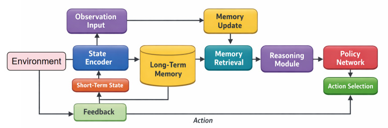
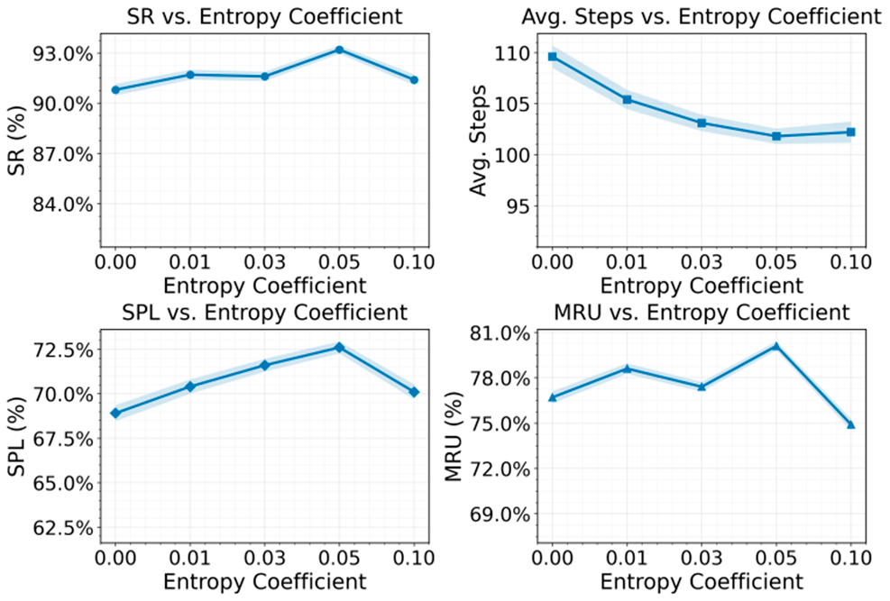
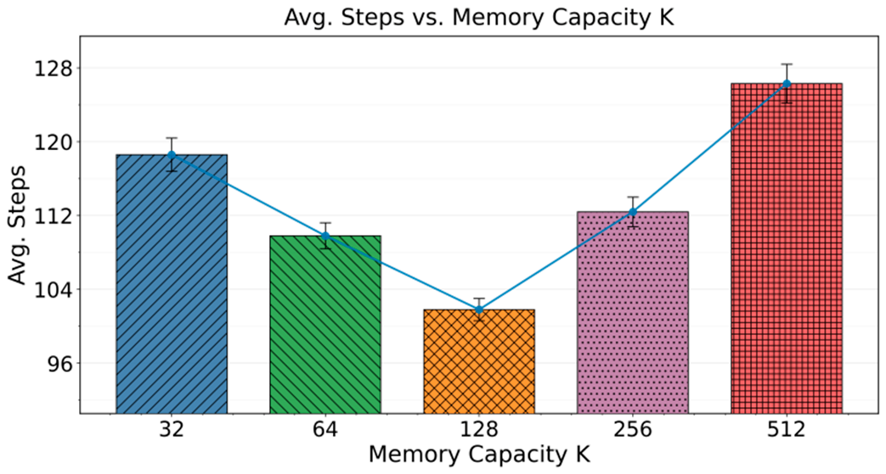

# preprints202602.1990.v1

### Article Not peer-reviewed version

# Cognitive Modeling for Long-Horizon Agent Learning via Integrated Long-

# Term Memory and Reasoning

Linghao Yang,Tian Guan, Yumeng Ma , Zhongkang Li , Zhou Fang ,Feiyang Wang * Posted Date: 28 February 2026 doi: 10.20944/preprints202602.1990.v1 Keywords: long-term cognitive modeling; agent learning; memory-reasoning fusion; sequential decision- making

Preprints.org is a free multidisciplinary platform providing preprint service that is dedicated to making early versions of research outputs permanently available and citable. Preprints posted at Preprints.org appear in Web of Science, Crossref, Google Scholar, Scilit, Europe PMC.

Copyright: This open access article is published under a Creative Commons CC BY 4.0 license, which permit the free download, distribution, and reuse, provided that the author and preprint are cited in any reuse.

<!-- Page 2 -->

 *Preprints.org *(www.preprints.org)  |  NOT PEER-REVIEWED  |  Posted: 28 February 2026   doi:10.20944/preprints202602.1990.v1  Disclaimer/Publisher’s Note: The statements, opinions, and data contained in all publications are solely those of the individual author(s) and contributor(s) and not of MDPI and/or the editor(s). MDPI and/or the editor(s) disclaim responsibility for any injury to people or property resulting from any ideas, methods, instructions, or products referred to in the content.

*Article*

## Cognitive Modeling for Long-Horizon Agent Learning via Integrated Long-Term Memory

## and Reasoning

 Linghao Yang 1 , Tian Guan 2 , Yumeng Ma 3 , Zhongkang Li 4 , Zhou Fang 5 and Feiyang Wang 6,  * 1University of Chicago, Chicago, USA 2University of California, Irvine, Irvine, USA 3Arizona State University, Tempe, USA 4New York University, New York, USA 5Georgia Institute of Technology, Atlanta, USA 6University of Illinois at Urbana-Champaign, Urbana, USA  *Correspondence: jackwang1885@gmail.com  Abstract  This study focuses on the tendency of agents in long-horizon sequential tasks to rely on short-term states and to underutilize historical information, and proposes a cognitive modeling and learning framework with long-term memory and reasoning capabilities. The framework provides a unified cognitive description of the agent's decision process. It introduces a structured long-term memory mechanism to support continuous storage and selective updating of cross-temporal key information.

On this basis, a memory retrieval-driven reasoning module is constructed so that experience can explicitly participate in the formation of current decision logic. To address the separation between memory and decision making in conventional policy models, the framework tightly couples perception representation, memory management, reasoning processes, and policy generation into an end-to-end cognitive loop. This design strengthens goal consistency and behavioral stability in long- horizon interactive environments. Comparative evaluations in open source interactive task settings demonstrate consistent advantages in task completion quality, decision efficiency, and long-term information utilization. The results indicate that the proposed cognitive modeling framework effectively mitigates decision difficulties caused by long-range dependencies and partial observability. Overall, the study shows that integrating long-term memory and reasoning within a unified learning framework is an important approach for improving sustained decision-making capability in complex environments.

 Keywords *:*long-term cognitive modeling; agent learning; memory-reasoning fusion; sequential decision-making  I. Introduction  As artificial intelligence systems move from single-task execution toward continuous interaction and autonomous decision-making in open environments, building agents with human-like cognitive capabilities has become a central research problem in intelligent systems[1]. Conventional models are mainly driven by short-term states or static inputs. They emphasize immediate responses and local optimization. They often fail to form a systematic understanding and utilization of historical experience in complex and dynamic environments. This weak memory and weak reasoning paradigm leads to unstable decisions, fragmented behaviors, and limited generalization when facing long-term dependencies, cross-stage objectives, and non-stationary environments. Therefore, developing cognitive modeling approaches for agents operating in long-horizon and continual interaction settings is a fundamental step toward more advanced artificial intelligence[2].

<!-- Page 3 -->

 *Preprints.org *(www.preprints.org)  |  NOT PEER-REVIEWED  |  Posted: 28 February 2026   doi:10.20944/preprints202602.1990.v1  2 of 8 Long-term memory is a key prerequisite for continuous learning and stable behavior in intelligent agents. In real-world scenarios, agents must accumulate experience across time, retain critical contextual information, and reuse it in future decisions. However, most existing learning frameworks process historical information within limited windows or through implicit compression.

They provide little support for structured and traceable long-term knowledge storage. This limitation restricts the agent's ability to understand environmental evolution and weakens the formation of consistent strategies in complex tasks. Mechanisms that allow agents to actively select, organize, and update long-term memory can overcome short-sighted decision-making and enable cross-stage coordination and experience transfer[3].

Reasoning capability serves as the essential link between memory and decision-making.

Memory storage alone is insufficient for high-quality intelligent behavior. What matters is whether an agent can reason over past information under the current context and infer future states and potential consequences. Decision-making in complex systems involves multiple constraints, latent relations, and long-term effects. It requires an integrated understanding of causal structure and logical consistency. Models without explicit reasoning tend to rely on pattern matching or experience accumulation. They struggle to adapt to environmental changes and task restructuring. Embedding reasoning mechanisms into learning frameworks enhances the control of long-term objectives, policy consistency, and decision interpretability.

From a cognitive modeling perspective, long-term memory and reasoning are not isolated components. Together, they form the core of the internal cognitive structure of an intelligent agent.

The coordination between memory stability and plasticity during learning, and the balance between historical experience and current observation during reasoning, directly affect learning efficiency and behavioral quality[4,5]. A unified cognitive modeling framework can integrate perception, memory, reasoning, and decision making into a coherent internal process. It allows agents to move beyond dependence on external rewards or immediate feedback and to develop intrinsic cognitive drivers aligned with long-term goals. This perspective provides a systematic theoretical foundation for understanding and designing complex intelligent systems.

At the application level, agent learning frameworks with long-term memory and reasoning capabilities are critical for many complex scenarios[6]. These include large-scale system scheduling, interactive services, long-term planning, and resource management. Agents in such settings must maintain decision consistency over time, adapt to environmental changes, and avoid policy degradation during prolonged operation. Cognitive level long-term modeling improves system stability, reliability, and adaptability. It also offers structured support for interpretable analysis of agent behavior[7]. Research on cognitive modeling centered on long-term memory and reasoning addresses key limitations of existing paradigms and lays the groundwork for more general, robust, and sustainably evolving intelligent systems.

 II. Methodological Foundations  The pursuit of robust long-term cognitive modeling in sequential decision-making draws from a range of foundational machine learning and reasoning methodologies. Advances in structural representation and generalization—notably through graph-based neural architectures—have provided the groundwork for modeling complex dependencies and relational patterns, supporting the development of agents capable of storing and updating cross-temporal knowledge in a structured fashion [8]. Recent studies on uncertainty quantification and risk-aware modeling introduce principled mechanisms for enhancing stability and trustworthiness in reasoning processes, which are essential for agents operating in dynamic and partially observable environments [9].

Further, transformer-based relational modeling and dynamic sequence analysis contribute tools for capturing intricate temporal dependencies and cross-stage relationships, critical for robust long- horizon memory management and policy consistency [10]. Methodologies that embed causal reasoning and knowledge representation are especially relevant for enabling agents to infer latent

<!-- Page 4 -->

 *Preprints.org *(www.preprints.org)  |  NOT PEER-REVIEWED  |  Posted: 28 February 2026   doi:10.20944/preprints202602.1990.v1  3 of 8 structures and intervention effects, thereby enhancing the reasoning component in cognitive architectures [11].

Progress in graph-transformer reconstruction and unsupervised anomaly detection inspires new directions in memory retrieval and selective attention, allowing for explicit participation of past experiences in current policy logic [12]. For environments characterized by distributional drift and temporal heterogeneity, residual-regulated learning frameworks help sustain adaptability and memory plasticity [13]. Pattern recognition strategies that incorporate structure-aware and semantically-enhanced graphs further strengthen the agent’s ability to identify, organize, and utilize relevant information across time, supporting efficient long-term decision-making [14]. Research on large language model integration with automated analysis underscores the ability of advanced sequence models to tightly couple perception, reasoning, and decision making within an end-to-end cognitive loop [15].

Theoretical developments in causal representation learning and attention-based recurrent models expand the possibilities for interpretable, goal-consistent decision-making under uncertainty and evolving objectives [16,17]. In addition, generative modeling approaches—such as those leveraging diffusion processes and conditional control—underscore the importance of memory- driven reasoning for robust policy formation in complex tasks [18]. Relational graph learning methods continue to inform how agents can perform multi-hop inference, facilitating cross-temporal experience transfer and consistent behavioral strategies [19]. Lastly, research in explainable representation learning and fine-grained semantic modeling supports the interpretability and transparency of agent behavior, which is critical for cognitive-level analysis and long-term strategic alignment [20]. Collectively, these methodological innovations provide the foundations for the proposed cognitive modeling framework, which unifies structured memory, retrieval-driven reasoning, and policy learning into a coherent architecture for sustainable and interpretable decision- making in complex environments.

 III. Proposed Framework  *A* *Overall Framework and Cognitive Modeling Objectives* This paper proposes a cognitive modeling and learning framework for intelligent agents with long-term memory and reasoning capabilities. Its core objective is to characterize the agent's continuous accumulation of historical experience and logical deduction of current decisions within a unified structure. The overall framework consists of perceptual representation, long-term memory, a reasoning module, and a decision function, forming a closed-loop cognitive link from environmental input to behavioral output. Let the time step betand the environmental observation be𝑜௧. The agent first maps these observations to potential cognitive states using an encoding function:

ℎ௧= 𝑓௘௡௖(𝑜௧)(1) This state serves as the foundational representation of current cognition and is directly involved in subsequent reasoning and decision-making in conjunction with long-term memory. By explicitly distinguishing between short-term perceptual states and long-term cognitive storage, the framework avoids over-compression of complex historical information into a single latent state and thus establishes a stable basis for structured reasoning.

To achieve robust separation and integration of cognitive states, the framework applies contextual trust evaluation mechanisms as proposed by Gao et al.[21], ensuring that both the credibility and temporal consistency of the current state are dynamically assessed and factored into multi-agent or multi-stage reasoning processes. For multi-task and cross-domain generalization, the model adopts dynamic prompt fusion techniques developed by Hu et al.[22], which enable adaptive combination of short-term perception and long-term knowledge across varying task demands and environmental contexts.

In the subsequent structured reasoning stage, the framework incorporates structure-aware decoding mechanisms introduced by Qiu et al. [23], supporting explicit information flow from long-

<!-- Page 5 -->

 *Preprints.org *(www.preprints.org)  |  NOT PEER-REVIEWED  |  Posted: 28 February 2026   doi:10.20944/preprints202602.1990.v1  4 of 8 term memory to current state inference. This not only enhances the interpretability of reasoning processes but also improves the agent’s ability to extract, update, and utilize complex relational information stored over extended temporal horizons. As illustrated in Figure 1, these modules work synergistically to provide a stable, cognitively inspired model architecture for long-term reasoning and decision-making.

 Figure 1. Overall model architecture.

*B* *Long-term memory modeling and updating mechanism* Long-term memory is modeled as a growing set of memories used to store key cognitive units across time scales. These memory units not only contain state information but also implicitly contain their semantic role in historical decision-making. Let long-term memory at timetbe represented as:

𝑀௧= {𝑚ଵ, . . . , 𝑚ே೟}(2) Eachm୧represents an abstract memory vector. The writing of the current perceptual state to the memory is controlled by a selective update function, which takes the form:

𝑀௧ାଵ= 𝑀௧∪𝑔௪௥௜௧௘(ℎ௧, 𝑀௧)(3) This mechanism enables agents to gradually expand their cognitive boundaries during continuous interaction, while avoiding irrelevant information from interfering with the memory space, thus achieving a balance between stability and plasticity.

*C* *Memory-based reasoning mechanisms* The reasoning module's role is to retrieve the most relevant cognitive information for decision- making from long-term memory and form a high-level semantic representation in the current context.

First, an attention-based retrieval mechanism is used to calculate the correlation between the current state and memory units:

்𝑚௜)(4) 𝛼௧= 𝑠𝑜𝑓𝑡𝑚𝑎𝑥(ℎ௧ Based on this, we obtain the memory aggregation representation:

ே೔ 𝑟௧= ∑ 𝛼௜𝑚௜ (5) ௜ୀଵ The reasoning results reflect the comprehensive influence of historical experience on current decision-making, enabling agents to logically connect the past and present, rather than relying solely on immediate observations, thereby enhancing the consistency and interpretability of decisions.

*D* *Decision function and overall learning objective* The final decision is jointly determined by the current perceptual state and the reasoning result, which are then fused at the cognitive level and mapped into an action strategy. Let the fusion function be:

𝑧௧= 𝜙(ℎ௧, 𝑟௧)(6) The corresponding decision-making strategy is expressed as:

𝜋(𝑎௧|𝑜௧) = 𝑠𝑜𝑓𝑡𝑚𝑎𝑥(𝑊𝑧௧)(7) Here,𝑊represents a learnable parameter. This design ensures that the agent's behavior is driven not only by the current environment but also by its long-term cognitive structure, thus

<!-- Page 6 -->

 *Preprints.org *(www.preprints.org)  |  NOT PEER-REVIEWED  |  Posted: 28 February 2026   doi:10.20944/preprints202602.1990.v1  5 of 8 forming decision preferences oriented towards long-term goals. By unifying long-term memory, reasoning processes, and policy generation within the same learning framework, this method provides a well-structured and logically consistent modeling path for constructing agents with continuous cognitive capabilities.

 IV. Experimental Analysis  *A* *Dataset* This work adopts the open-source interactive agent dataset WebShop as the evaluation platform.

WebShop constructs an interactive environment that simulates an online shopping website. The agent receives natural language instructions as input and completes goal-oriented tasks through multi-page and multi-step web browsing and operations. The dataset includes a large-scale product catalog and corresponding instruction sets. Tasks require the agent to gradually approach the goal through a sequence of actions such as searching, filtering, comparing, and selecting. This setting forms a representative problem of long-horizon decision-making combined with information retrieval. In terms of aligning with the research theme, the core characteristic of WebShop is its reliance on accumulating cross-step information and satisfying conditional constraints. The agent must retain crucial information encountered on earlier pages, such as attribute conditions, candidate product cues, and previously attempted queries and navigation paths. This information is used for reasoning and correcting decisions in subsequent choices based on historical trajectories. The interaction process naturally involves long-term dependencies, partial observability, and iterative policy adjustments. It effectively assesses the agent’s ability to store and retrieve long-term memory and the consistency of its reasoning under goal constraints. These properties closely match the focus on long-term memory and reasoning-driven agent cognitive modeling.

Regarding data structure and usage, WebShop organizes samples in a sequential interaction format of instruction, web state, action, and feedback. This structure facilitates mapping the perception representation, long-term memory update, memory retrieval, and reasoning-based decision modules of the proposed method into a unified closed-loop process. Compared with static question answering or single-step classification tasks, WebShop emphasizes procedural cognition and policy sustainability. The model must not only understand the current observation but also preserve and utilize historical information in a structured manner. As a result, the dataset provides a clear, reproducible, and open evaluation platform with realistic semantic noise for studying cognitive modeling and learning frameworks.

*B* *Experimental Results* This article first presents the results of the comparative experiments, as shown in Table 1.

 Table 1. Comparative experimental results.

|Method|SR%|Avg. Steps|SPL%|MRU%|
|---|---|---|---|---|
|**MARL-CC[23]**|84.7|128.6|62.3|71.5|
|**Masrouter[25]**|86.9|121.4|64.8|73.2|
|**Robin[26]**|88.1|117.9|66.5|74.6|
|**G-safeguard[27]**|89.4|113.2|68.1|76.0|
|**Pathfinder[28]**|90.6|109.7|69.4|77.3|
|**Ours**|93.2|101.8|72.6|80.1|

Overall, the proposed method demonstrates a more balanced advantage in task completion quality, decision efficiency, and process consistency, aligning well with its long-term memory– and reasoning–driven cognitive design. Unlike baselines relying on short-term cues or local heuristics, the framework builds a stable internal cognitive state that supports goal-oriented behavior over long

<!-- Page 7 -->

 *Preprints.org *(www.preprints.org)  |  NOT PEER-REVIEWED  |  Posted: 28 February 2026   doi:10.20944/preprints202602.1990.v1  6 of 8 horizons, reducing policy oscillation and ineffective exploration. Improvements in task success indicate sustained awareness of constraints across extended decision sequences, while gains in efficiency metrics reflect more directed actions enabled by structured memory retrieval and reasoning.

The concurrent improvement in memory utilization further shows that performance gains stem from effective long-term information use rather than incidental policy bias, supporting coherent reasoning chains and better interpretability in complex tasks; the sensitivity of these behaviors to the entropy regularization coefficient is analyzed in Figure 2.

 Figure 2. The impact of the entropy canonical coefficient on experimental results.

The results show that the entropy regularization coefficient critically balances policy randomness and goal-directed behavior: low values lead to early deterministic convergence with limited exploration, while moderate values promote effective exploration that supports stable memory writing, retrieval, and coherent reasoning across long decision horizons. Task completion quality and efficiency peak within a suitable coefficient range, where exploration enhances information coverage without disrupting reasoning consistency; overly high entropy introduces excessive randomness, weakens memory reuse, and reduces efficiency. Memory utilization trends further confirm that performance gains arise from effective long-term memory consolidation and reuse, which degrade when exploration becomes too noisy. Finally, the impact of memory capacity (K) on stability and reasoning efficiency is analyzed in Figure 3.

 Figure 3. Avg. Steps' sensitivity experiment to memory capacity K.

The results show that memory capacity affects decision-making in a stage-dependent, non-linear manner, indicating that simply increasing memory size does not continuously improve performance in long-horizon tasks. With moderate capacity, the agent retains the most discriminative information, reducing interference and enabling more stable reasoning and compact decision trajectories.

However, excessively large memory introduces retrieval noise and attention diffusion, weakening reasoning stability and increasing hesitation. Overall, these findings highlight that effective long-term

<!-- Page 8 -->

 *Preprints.org *(www.preprints.org)  |  NOT PEER-REVIEWED  |  Posted: 28 February 2026   doi:10.20944/preprints202602.1990.v1  7 of 8 cognition depends on well-structured, selectively managed memory integrated with reasoning, rather than unbounded memory expansion.

 V. Conclusions  This paper addresses agent cognitive modeling with long-term memory and reasoning capabilities and proposes a unified learning framework. The framework integrates perception representation, long- term memory management, reasoning mechanisms, and decision policies into a single cognitive loop. By explicitly modeling the storage, retrieval, and reasoning roles of historical information, the approach overcomes the strong dependence on short-term states in conventional policy learning. It enables agents to maintain more stable goal orientation and decision consistency in long-horizon interactive tasks. The study demonstrates that strengthening the use of historical experience at the cognitive structure level is a critical pathway to improving performance in complex tasks.

At the methodological level, long-term memory is treated as a core cognitive component rather than a simple state buffer. Memory retrieval results are directly incorporated into reasoning and policy generation. This allows the agent to integrate past and current information more effectively when dealing with multi-stage tasks and partially observable environments. As a result, the agent can form coherent action sequences across time. This design improves decision efficiency and stability. It also provides structured support for interpretable analysis of agent behavior, which helps explain how historical information is used in long-horizon decision-making.

From an application perspective, the proposed cognitive modeling framework is relevant to a wide range of real-world scenarios. Systems that require continuous decision making and long-term planning often face long task horizons, frequent state changes, and sparse feedback. Examples include complex service process management, large-scale information retrieval, and interactive recommendation systems.

Agents equipped with long-term memory and reasoning can better maintain global goal consistency, reduce ineffective exploration, and prevent policy degradation. This leads to improved system efficiency and user experience. These observations indicate strong potential for practical deployment of cognition- driven agent designs.

Looking ahead, further development of long-term memory and reasoning mechanisms will support the construction of more general and reliable agents. Adaptive strategies for memory organization and updating in open environments will directly affect scalability in continual learning settings. In addition, combining cognitive modeling with practical constraints such as safety and resource limits may enable more stable deployment in complex systems. Overall, this work offers new insights into understanding and designing long-term intelligent behavior from a cognitive perspective. It also provides valuable reference for the sustained evolution and performance improvement of intelligent systems in related application domains.

 References

1. 

S. Yao, H. Chen, J. Yang, et al., "Webshop: Towards scalable real-world web interaction with grounded language agents," Advances in Neural Information Processing Systems, vol. 35, pp. 20744-20757, 2022.

2. 

S. Yao, J. Zhao, D. Yu, et al., "React: Synergizing reasoning and acting in language models," Proceedings of the Eleventh International Conference on Learning Representations, 2022.

3. 

N. Shinn, F. Cassano, A. Gopinath, et al., "Reflexion: Language agents with verbal reinforcement learning," Advances in Neural Information Processing Systems, vol. 36, pp. 8634-8652, 2023.

4. 

J. S. Park, J. O'Brien, C. J. Cai, et al., "Generative agents: Interactive simulacra of human behavior," Proceedings of the 36th Annual ACM Symposium on User Interface Software and Technology, pp. 1-22, 2023.

5. 

C. Packer, V. Fang, S. G. Patil, et al., "MemGPT: Towards LLMs as Operating Systems," 2023.

6. 

W. Zhong, L. Guo, Q. Gao, et al., "Memorybank: Enhancing large language models with long-term memory," Proceedings of the AAAI Conference on Artificial Intelligence, vol. 38, no. 17, pp. 19724-19731, 2024.

7. 

G. Wang, Y. Xie, Y. Jiang, et al., "Voyager: An open-ended embodied agent with large language models," arXiv preprint arXiv:2305.16291, 2023.

<!-- Page 9 -->

 *Preprints.org *(www.preprints.org)  |  NOT PEER-REVIEWED  |  Posted: 28 February 2026   doi:10.20944/preprints202602.1990.v1  8 of 8

8. 

C. Hu, Z. Cheng, D. Wu, Y. Wang, F. Liu and Z. Qiu, "Structural generalization for microservice routing using graph neural networks," arXiv preprint arXiv:2510.15210, 2025.

9. 

S. Pan and D. Wu, "Trustworthy summarization via uncertainty quantification and risk awareness in large language models," arXiv preprint arXiv:2510.01231, 2025.

10. 

Y. Wu, Y. Qin, X. Su and Y. Lin, "Transformer-based risk monitoring for anti-money laundering with transaction graph integration," Proceedings of the 2025 2nd International Conference on Digital Economy, Blockchain and Artificial Intelligence, pp. 388-393, 2025.

11. 

R. Ying, Q. Liu, Y. Wang and Y. Xiao, "AI-Based Causal Reasoning over Knowledge Graphs for Data-Driven and Intervention-Oriented Enterprise Performance Analysis," 2025.

12. 

C. Zhang, C. Shao, J. Jiang, Y. Ni and X. Sun, "Graph-Transformer Reconstruction Learning for Unsupervised Anomaly Detection in Dependency-Coupled Systems," 2025.

13. 

Y. Ou, S. Huang, R. Yan, K. Zhou, Y. Shu and Y. Huang, "A Residual-Regulated Machine Learning Method for Non-Stationary Time Series Forecasting Using Second-Order Differencing," 2025.

14. 

N. Lyu, J. Jiang, L. Chang, C. Shao, F. Chen and C. Zhang, "Improving Pattern Recognition of Scheduling Anomalies through Structure-Aware and Semantically-Enhanced Graphs," arXiv preprint arXiv:2512.18673,

2025. 
15. 

C. Wang, T. Yuan, C. Hua, L. Chang, X. Yang and Z. Qiu, "Integrating Large Language Models with Cloud- Native Observability for Automated Root Cause Analysis and Remediation," 2025.

16. 

J. Li, Q. Gan, R. Wu, C. Chen, R. Fang and J. Lai, "Causal Representation Learning for Robust and Interpretable Audit Risk Identification in Financial Systems," 2025.

17. 

J. Li, Q. Gan, Z. Liu, C. Chiang, R. Ying and C. Chen, "An Improved Attention-Based LSTM Neural Network for Intelligent Anomaly Detection in Financial Statements," 2025.

18. 

R. Liu, L. Yang, R. Zhang and S. Wang, "Generative Modeling of Human-Computer Interfaces with Diffusion Processes and Conditional Control," arXiv preprint arXiv:2601.06823, 2026.

19. 

K. Cao, Y. Zhao, H. Chen, X. Liang, Y. Zheng and S. Huang, "Multi-Hop Relational Modeling for Credit Fraud Detection via Graph Neural Networks," 2025.

20. 

Y. Xing, M. Wang, Y. Deng, H. Liu and Y. Zi, "Explainable Representation Learning in Large Language Models for Fine-Grained Sentiment and Opinion Classification," 2025.

21. 

K. Gao, H. Zhu, R. Liu, J. Li, X. Yan and Y. Hu, "Contextual Trust Evaluation for Robust Coordination in Large Language Model Multi-Agent Systems," 2025.

22. 

X. Hu, Y. Kang, G. Yao, T. Kang, M. Wang and H. Liu, "Dynamic prompt fusion for multi-task and cross-domain adaptation in LLMs," arXiv preprint arXiv:2509.18113, 2025.

23. 

Z. Qiu, D. Wu, F. Liu, C. Hu and Y. Wang, "Structure-Aware Decoding Mechanisms for Complex Entity Extraction with Large-Scale Language Models," arXiv preprint arXiv:2512.13980, 2025.

24. 

M. Taghavi and J. Vahidi, "MARL-CC: A Mathematical Framework for Multi-Agent Reinforcement Learning in Connected Autonomous Vehicles: Addressing Nonlinearity, Partial Observability, and Credit Assignment for Optimal Control," arXiv preprint arXiv:2511.17653, 2025.

25. 

Y. Yue, G. Zhang, B. Liu, et al., "Masrouter: Learning to route LLMs for multi-agent systems," arXiv preprint arXiv:2502.11133, 2025.

26. 

A. E. Ghareeb, B. Chang, L. Mitchener, et al., "Robin: A multi-agent system for automating scientific discovery," arXiv preprint arXiv:2505.13400, 2025.

27. 

S. Wang, G. Zhang, M. Yu, et al., "G-safeguard: A topology-guided security lens and treatment on LLM-based multi-agent systems," arXiv preprint arXiv:2502.11127, 2025.

28. 

F. Ghezloo, M. S. Seyfioglu, R. Soraki, et al., "Pathfinder: A multi-modal multi-agent system for medical diagnostic decision-making applied to histopathology," arXiv preprint arXiv:2502.08916, 2025.

 Disclaimer/Publisher’s Note: The statements, opinions and data contained in all publications are solely those of the individual author(s) and contributor(s) and not of MDPI and/or the editor(s). MDPI and/or the editor(s) disclaim responsibility for any injury to people or property resulting from any ideas, methods, instructions or products referred to in the content.
